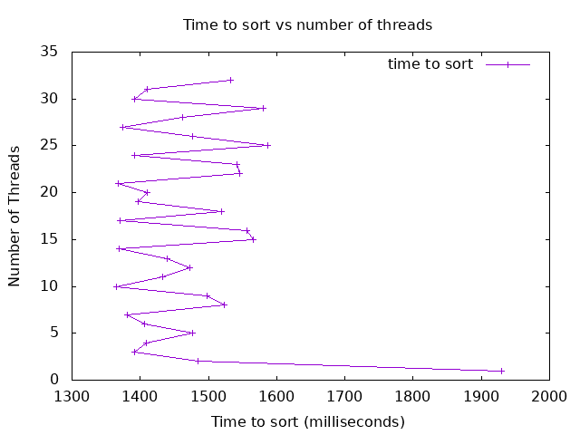

## Analysis to the bottom of the document

*Were you able to generate something close to what the example showed? Why or why not.*

The reults will pretty close the the results, but I think there was a bit more variation in how fast the threads went as more threads were added. This is probably my approach on where the split happened in which I always rounded up. However, If I were to do this experiment 1000 times and take the average, I believe the results will get closer and closer to the actual results shown by shane. I also noticed that if I ran a sorting algorithm 2 times on the same parameters, they both would complete and differnent times. This is probably due to random arrays variations results for different variations.

Did you see a slow down at some point why or why not?

Yes similarly to what was seen in shanes experiment/ I saw it slowdown at around 24 threads. Typically as recommended  by Dr. Amit, the optimal number of threads is usually 2-3x the number of cores

Did your program run faster and faster when you added more threads? Why or why not?

Yes, the most optimal increase is between 1-6, after that there was significant diminishing returns on the increase in speed. Infact is started slowing down after 24 threads. As noted, this is probanly due to the great number of context switches that has to happen. One very complicated way to optimize this futhur is to started merge already sorted arrays, free up threas for the the arrays that are taking alot of time to sort

What was the optimum number of threads for your machine?

Although 24 is the correct answer, realisticlly I would say 8 becuase and more then that I would not gain much benefits.

What was the slowest number of threads for your machine?

Sowest was 1 thread then 32 threads. 1 thread for obviose reasons, but 32, threads because it has the maximum number of context swithches which makes it go even slower then 2 threads.